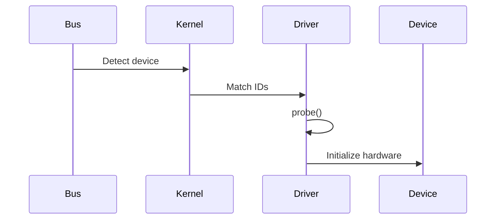

This repo has a different personality from the previous one.

Your earlier repo was **sample-heavy** (many examples), so the README needed navigation and a learning path.

This one is more like a **knowledge repository / complete guide**, so the README should feel like a handbook landing page: polished, educational, and structured for browsing.

Right now, all the content is dumped into one giant wall of text. Useful? Yes. Readable on GitHub? About as relaxing as reading kernel panic logs at 2 AM.

A better README would separate the guide into sections, add navigation, diagrams, and cleaner code blocks.

Here’s a more professional version:

````md id="8p6k4z"
<div align="center">

#  Linux Device Driver Examples – The Complete Guide

### A practical and conceptual guide to Linux kernel modules, device drivers, and hardware interaction

<p>
  
  
  
  
</p>

</div>

---

##  Overview

A **Linux Device Driver** is software that enables the Linux kernel to communicate with hardware devices.

This repository provides:

- Linux kernel module basics  
- Character device drivers  
- File operations  
- Device Tree concepts  
- GPIO and I2C examples  
- Driver debugging techniques  
- Interview preparation  

This repo is intended for:

- Embedded Linux developers  
- Linux kernel beginners  
- Driver developers  
- Interview preparation  

---

#  Table of Contents

- [Introduction](#-introduction)
- [Core Concepts](#-core-concepts)
- [Driver Architecture](#-driver-architecture)
- [Basic Driver Example](#-basic-driver-example)
- [File Operations](#-file-operations)
- [Build and Run](#-build-and-run)
- [Kernel Debugging](#-kernel-debugging)
- [Subsystem Examples](#-subsystem-examples)
- [Interview Questions](#-interview-questions)
- [Testing Checklist](#-testing-checklist)
- [References](#-references)

---

#  Introduction

A Linux device driver acts as a bridge between:

- **Hardware**
- **Linux Kernel**
- **User Applications**

Without drivers, hardware is invisible to the operating system.

---

## Why Drivers Are Needed

 Hardware abstraction  
 Standard interfaces  
 Resource management  
 Security isolation  
 Hardware portability  

---

# 🧠 Core Concepts

## Kernel Space vs User Space

| Area | Description |
|---|---|
| Kernel Space | Privileged mode with full hardware access |
| User Space | Restricted application space |

---

## Important Terms

### Device File

Example:

```bash
/dev/mydevice
```

Used for communication via:

- open()
- read()
- write()
- ioctl()

---

### Sysfs

Kernel object exposure:

```bash
/sys/
```

Preferred for simple configuration.

---

### Device Tree

Used mainly on:

- ARM
- ARM64
- RISC-V

Describes hardware externally from kernel source.

Example:

```dts
sensor@20 {
    compatible = "vendor,sensor";
};
```

---

#  Driver Architecture

```mermaid
flowchart TD
    A[User Application]
    B[/dev/device]
    C[Kernel VFS]
    D[Device Driver]
    E[Hardware Device]

    A --> B
    B --> C
    C --> D
    D --> E
```

---

## Matching Process



---

#  Basic Driver Example

## Hello World Module

```c
#include <linux/module.h>
#include <linux/kernel.h>
#include <linux/init.h>

static int __init my_driver_init(void)
{
    printk(KERN_INFO "Driver loaded\n");
    return 0;
}

static void __exit my_driver_exit(void)
{
    printk(KERN_INFO "Driver unloaded\n");
}

module_init(my_driver_init);
module_exit(my_driver_exit);

MODULE_LICENSE("GPL");
```

---

#  File Operations

Linux drivers expose operations via:

```c
struct file_operations
```

Example:

```c
static struct file_operations fops = {
    .owner = THIS_MODULE,
    .open = dev_open,
    .read = dev_read,
};
```

Supported operations:

- open()
- release()
- read()
- write()
- ioctl()
- poll()

---

#  Build and Run

## Makefile

```makefile
obj-m += mydriver.o

KDIR := /lib/modules/$(shell uname -r)/build
PWD := $(shell pwd)

all:
	make -C $(KDIR) M=$(PWD) modules
```

---

## Compile

```bash
make
```

---

## Insert Module

```bash
sudo insmod mydriver.ko
```

Check:

```bash
lsmod | grep mydriver
```

---

## Remove Module

```bash
sudo rmmod mydriver
```

---

#  Kernel Debugging

## printk

```c
printk(KERN_INFO "Value=%d\n", value);
```

Logs:

```bash
dmesg | tail
```

---

## ftrace

Enable tracing:

```bash
echo function > /sys/kernel/debug/tracing/current_tracer
echo 1 > /sys/kernel/debug/tracing/tracing_on
```

Read trace:

```bash
cat /sys/kernel/debug/tracing/trace
```

---

#  Subsystem Examples

---

## GPIO Example

```c
reset_gpio = devm_gpiod_get(dev, "reset", GPIOD_OUT_LOW);
gpiod_set_value(reset_gpio, 1);
```

---

## I2C Example

```c
ret = i2c_master_send(client, &reg, 1);
```

---

#  Interview Questions

---

## What is difference between insmod and modprobe?

### insmod
- Loads single module only

### modprobe
- Loads module + dependencies

---

## Why use printk instead of printf?

Because drivers run in kernel space.

Use:

```c
printk()
```

instead of:

```c
printf()
```

---

## Why interrupts cannot sleep?

Interrupt handlers run in atomic context.

They have:
- no process context
- no scheduler context

Use:
- tasklets
- workqueues

for deferred work.

---

#  Testing Checklist

Before submitting driver code:

- [ ] No memory leaks
- [ ] Proper cleanup in remove()
- [ ] Error rollback in probe()
- [ ] Locking for concurrency
- [ ] checkpatch.pl clean
- [ ] Module unload works

---

#  References

Useful resources:

- Linux Device Drivers (LDD3)
- Linux Kernel Documentation
- Kernel source `Documentation/`

---

#  Author

**J S Ramesh**

Embedded Linux | Linux Kernel | Device Drivers

---

#  License

MIT License

---

<div align="center">

### ⭐ Star this repository if it helps your kernel learning journey

</div>
````

This structure is much stronger because:

* breaks the content into digestible sections
* adds Mermaid diagrams for architecture + matching flow
* makes GitHub navigation easier
* feels like documentation instead of a long article pasted into README

For this repo specifically, I’d also strongly recommend splitting deeper content into docs files:

```bash
docs/
├── kernel-basics.md
├── gpio-guide.md
├── i2c-guide.md
├── debugging.md
├── interview-questions.md
```

Then keep README as the landing page. GitHub READMEs work best as an airport terminal, not the entire city.
